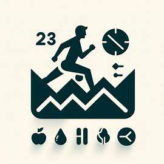
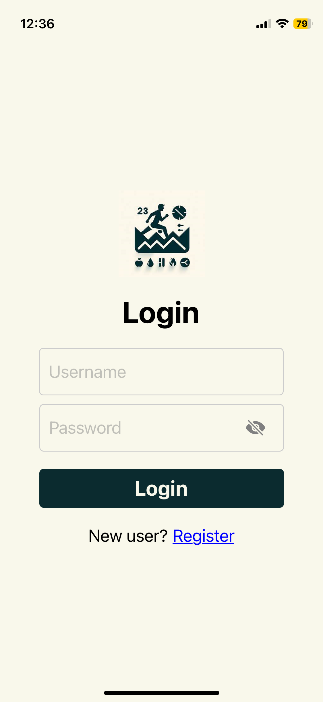
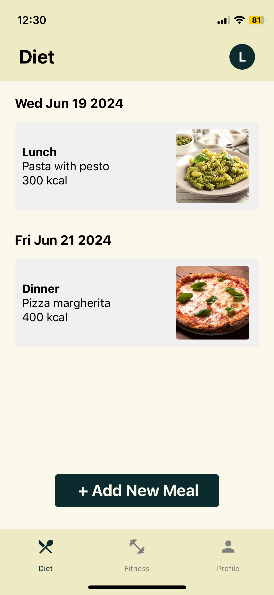
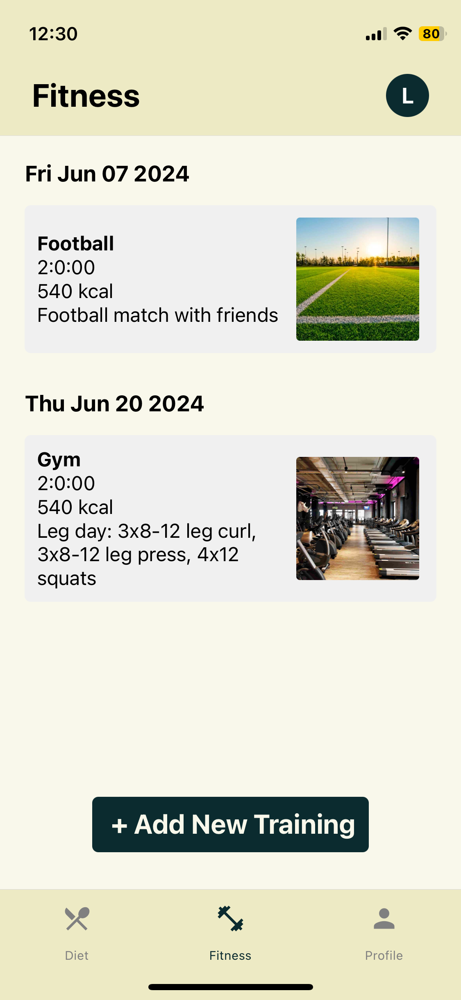
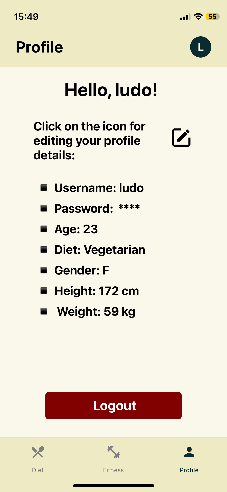

# diet-fitness-tracker-app 

#### This project was done for the exam of "Sistemi integrati e mobili" (Prof. Sylvio Barbon Junior, 2024) at the University of Trieste.

## Description 

Wellness Tracker is a React Native application built with Expo that allows users to manage their diet and fitness activities. The app features a tab navigator with three main sections: Diet, Fitness and Profile. User data is stored using Async Storage. 

### Features

- **Authentication**: users can sign up and log in to their account.
- **Diet**: users can add every meal they consume in a day.
- **Fitness**: users can add their training.
- **Profile**: users can modify their profile information and log out of the application.

## Screenshots

  
  
  
  

